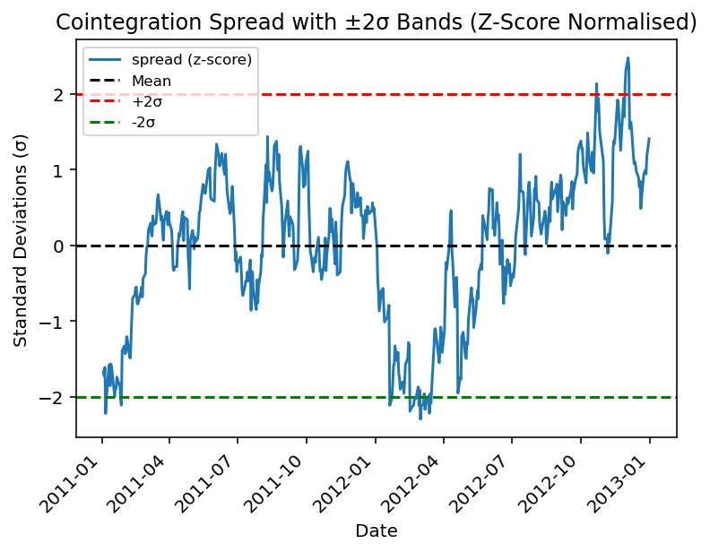
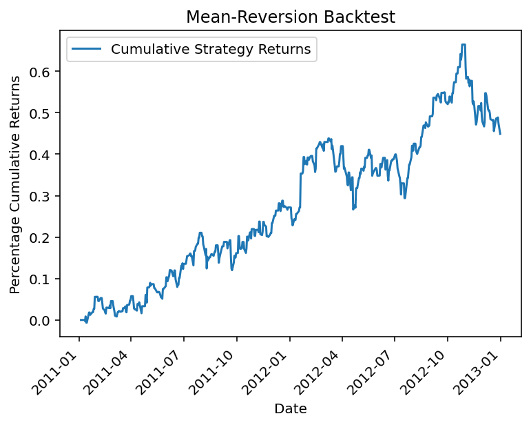

# Notes as I work through the project - how and why do things work etc

## **14 August 2025:**  
Using the Johansen test with the tickers 'XOM', 'CVX', 'BP', 'COP' from 1 Jan 2024 to 1 Feb 2024, I have the results:
Rank 0: Cointegration exists\
Rank 1: Not cointegrated\
Rank 2: Not cointegrated\
Rank 3: Not cointegrated\

So, there is at exactly one cointegrating relationship. Thus, the set of 4 stocks share one stationary linear combination.  

Using johansen_result.evec, can get the weights for each of the stocks. Normalise them, and build a spread (adj_close.dot(normalised_weights)).  

Use an ADF test to check if it stationary. I then plotted a graph with the spread over time, with the mean and mean +/- 2 standard deviations.  

---

## 18 August 2025:

Wanted cointegrated stocks over a longer time period but haven't found an efficient way to test stock cointegration yet - was just hardcoding different dates and stocks into my code.  
So, used the good old Apple (APPL) and Microsoft (MSFT) stocks, and found they were cointegrated between 01/01/2011 and 01/01/2013.  
Constructed the spread and checked stationary with an ADF test. Then plotted the z-score spread (so normalised by standard deviations) over those dates with mean +/- 2 standard deviations.  
  

Then, backtested this using a mean-reversion backtest. Did this by:  
  1. Computing the z-score of the spread (how many std away from the mean it was)
  2. Generate signals - if under threshold = long the stock, or if under threshold = short the stock. I used a threshold of 2 theta.
  3. Then, close the positions when it crosses the mean.
  4. Computed the daily returns of the spread, and plotted the cumulative returns (as a percentage).

